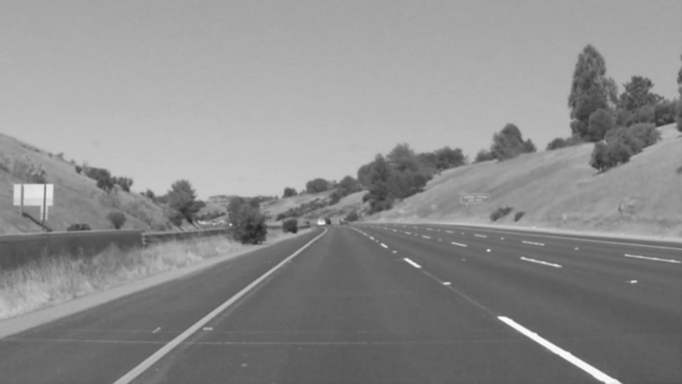
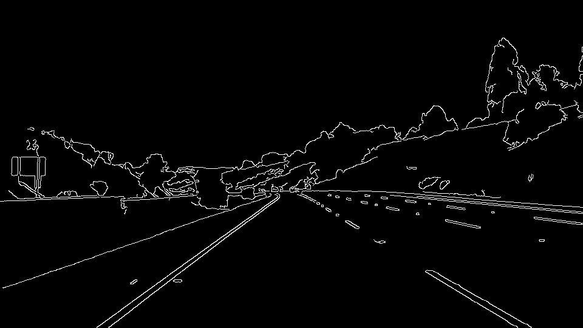
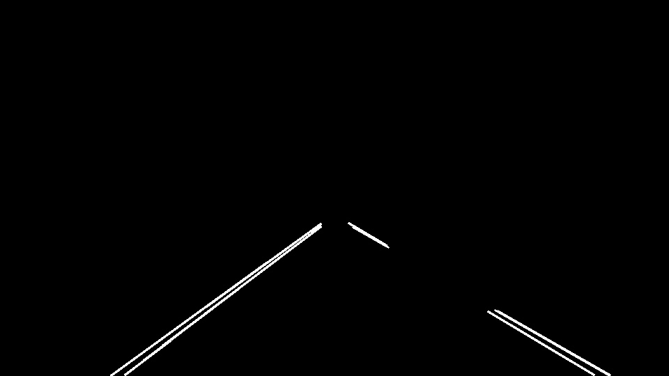
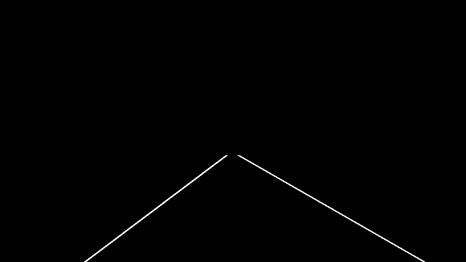

# Finding Lane Lines on the Road

The goals / steps of this project are the following:
* Make a pipeline that finds lane lines on the road
* Reflect on your work in a written report

## Pipeline
The flow fo the Lane detection project is as follows:
 * ### Pre-process the input image:
    * Convert the RGB image to grayscale.
    * Apply Gaussian blur on the grayscale image.
    
   
 * ### Canny edge detection
   
 * ### Hough line detection
   
 * ### Extrapolation of hough lines to left and right lanes
   
---
The draw_lines() function was extended to draw the left and right lanes. This was done by the following approach:
 * Remove the outliers in the Hough lines output by using mean and 2*standard deviation of the line slopes.
 * Filter Hough lines based on its slope. I.e., for right lanes, select lines whose slope lies in the range (0, 0.8) and left lanes in the range (-0.8, 0).
 * Consider the median value of slope and y-intercept of the left and right filtered lines. This median value is used as the final parameters of the lane line.
 * Using the above result, fit the lines in the ROI.

## Identify potential shortcomings with your current pipeline

* A potential shortcoming is that since basic Computer Vision algorithms are used, there could be edge cases which were not considered while developing this project. The algorithm proves to work if the camera is set with similar extrinsic parameters as used in the sample videos, but may/may not fail in other cases(yet to be tested).

* To dig deeper, another shortcoming is that curved lane lines are not considered in this approach.

## Suggest possible improvements to your pipeline

 * Apply polynomial curve fitting to final lane detection step from Hough lines to consider curved lanes.
 * Remove hard-coding of ROI for lanes and come up with a generic approach.
